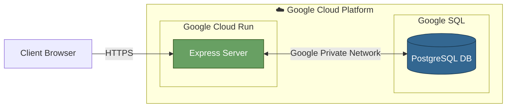
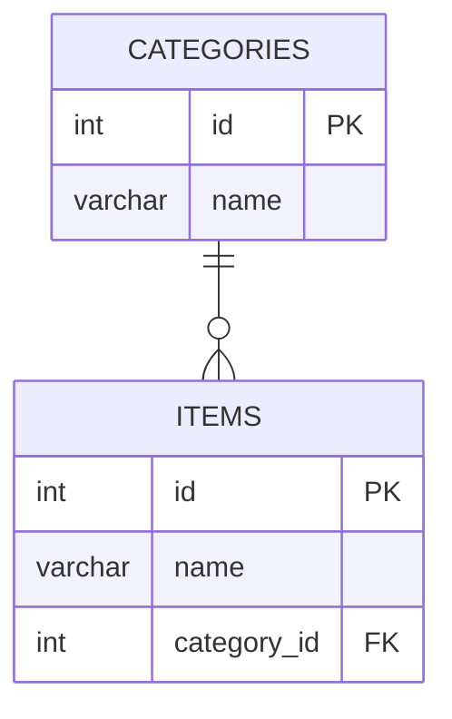

# An inventory application

## Architecture

The system was intended to be used by a non-authenticated user to add categories and items to that category.

If a category is deleted then all items will be cascadingly deleted as well.

The pattern for this system is MVC

### System Design

### Database Schema

## Installation

After setting the .env variables the project can be ran with
`npm install` then `npm run dev`
